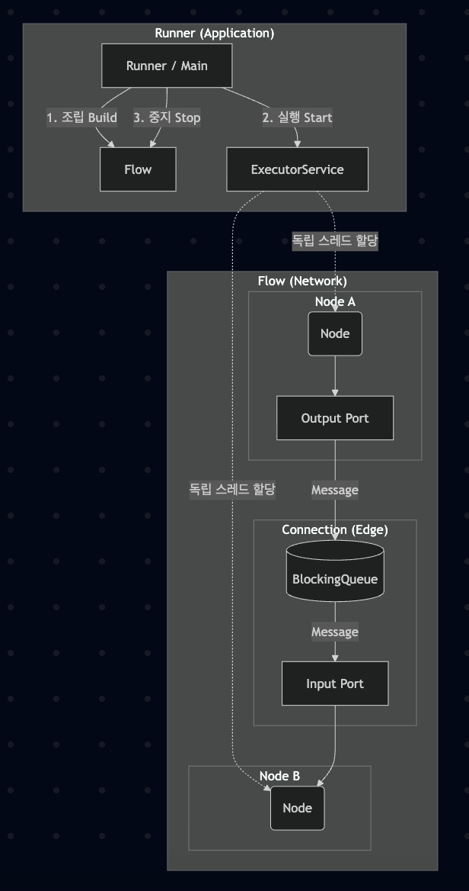

#### FBP 엔진 핵심 클래스
| 클래스 명               | 역할             | 소속 패키지          |
| --------------------- | --------------- | ----------- |
| **Node** (Component)  | 데이터를 처리하는 독립 단위 | core/         |
| **Port** (In/Out)     | 노드의 입구와 출구      | core/ |
| **Connection** (Edge) | 포트 사이를 연결하는 통로  | core/     |
| **Message** (IP)      | 노드 사이를 이동하는 데이터 | message/    |
| **Flow** (Network)    | 노드와 연결의 전체 구성도  | runner/      |
| **Runner** (Application)    | 엔진 실행 진입점 | runner/     |

> - 노드와 노드 사이에 데이터는 어떤 경로로 전달되는가?
    =>> Port를 통해 데이터가 들어오고 나가며, Connection을 통해 데이터가 흐른다
> - 노드가 동시에 동작하려면 무엇이 필요한가?
    =>> 다중 쓰레드 방식으로 구현해 프로세스가 동시 병렬적으로  수행 될 수 있게 해야한다.
> - 플로우를 "실행"한다는 것은 구체적으로 무엇을 의미하는가?
    =>> Node, Message, Port, Connection을 알맞게 배치하고 조립-실행-중지 등을 제어하는 것을 의미한다.

> - ConcurrentModificationException 또는 IndexOutOfBoundsException이 발생하는가?
    =>> while 루프에서 buffer.isEmpty()를 검사하지만,
        버퍼가 비어 있지 않은 상태로 여러 소비자 쓰레드가 검사블록을 빠져나간 후, 
        버퍼에 남은 메시지 이상으로 꺼내려고 시도 할 경우... 예외가 발생한다.
        예시: 버퍼에 남은 메시지는 1개... 여러 소비자 쓰레드가 이를 확인하고 검사블록을 빠져나감... 소비자가 버퍼에 남은 메시지 수 이상으로 꺼내려고 시도.
> - 소비자가 같은 메시지를 두 번 꺼내거나, 메시지가 유실되는 경우가 있는가?
    =>> 여러 소비자가 동시에 메시지를 꺼내려고 시도하면, 메시지를 중복으로 꺼낼 수 있음
> - 소비자의 while(!buffer.isEmpty()) 루프가 CPU를 100% 점유하는가? (busy-waiting)
    =>> 멀티코어 CPU 이므로, CPU를 100% 점유 하지는 않지만 코어 한개를 단독으로 100% 점유한다.
> - 생산자가 끝난 뒤, 소비자가 종료 시점을 어떻게 알 수 있는가?
    =>> 플래그나 인터럽트를 이용 할 수 있다.

#### ArrayList, synchronized, BlockingQueue 비교
| 방식                       | 코드 라인 수         | 예외 처리 복잡도 | CPU 사용률         |
|--------------------------|-----------------|-----------|-----------------|
| ArrayList                | 가장 많음           | 복잡함       | 100% (단일 코어 전체) |
| synchronized             | 중간              | 중간        | 3.6% ~ 4.0%     |
| BlockingQueue            | 적음              | 쉬움        | 3.4% ~ 3.8%     |
